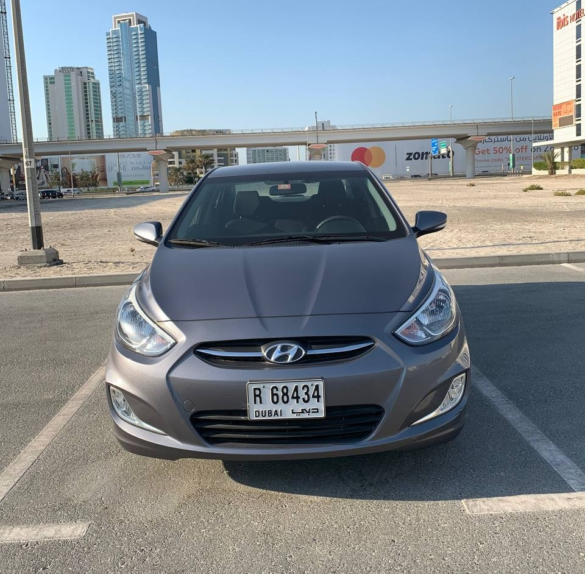
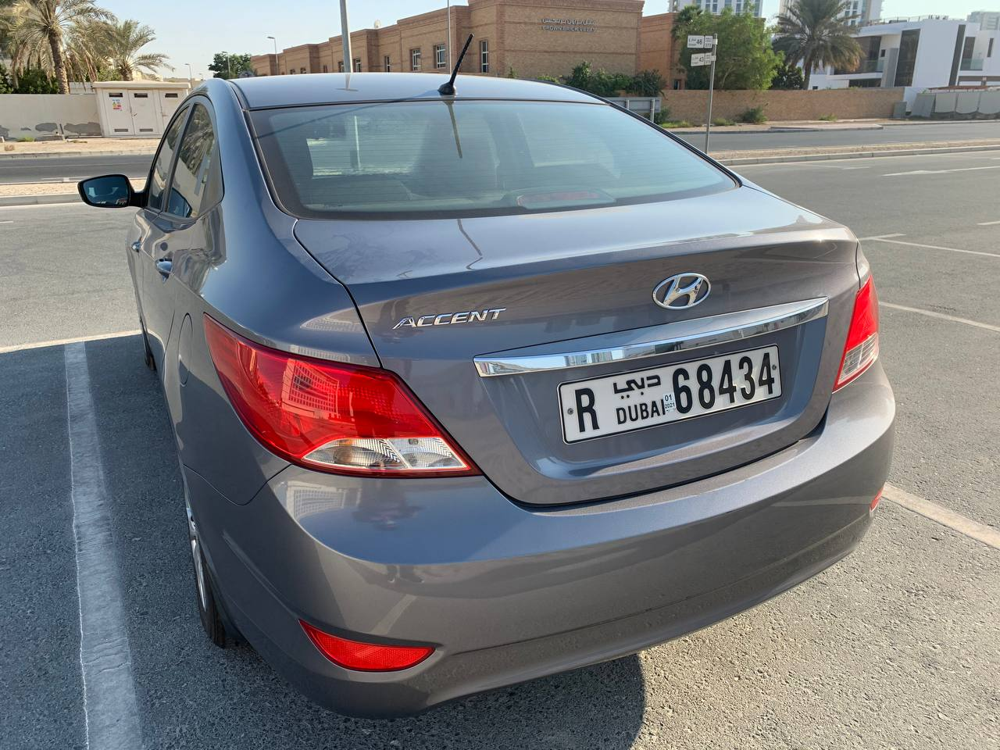
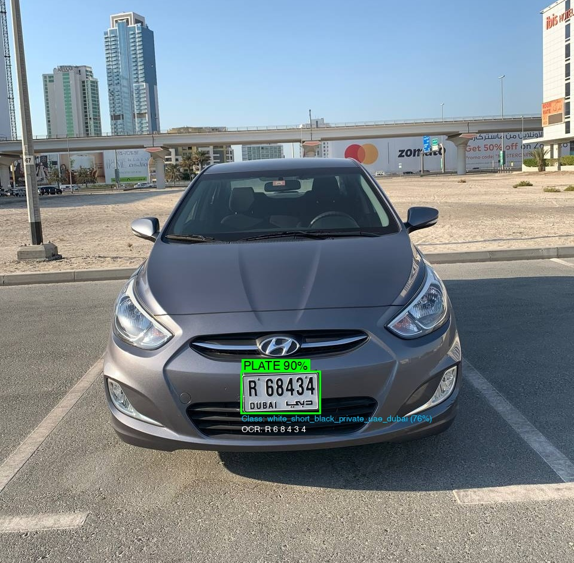
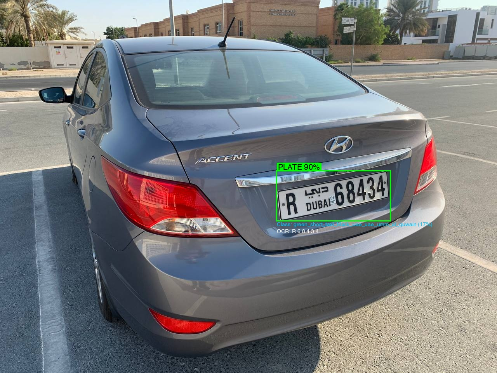
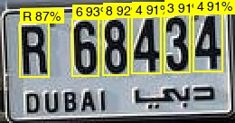
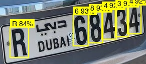

# ANPR Laravel SDK

**Automatic Number Plate Recognition for Laravel** - Detect, read, and classify license plates from any image in seconds. Built for all GCC countries: UAE, Saudi Arabia, Qatar, Kuwait, Bahrain, and Oman. 
Detects the plate number, plate code, country, emirate (in UAE), type (private, commercial, export etc.), plate size, plate color, plate text color. 

```php
$result = Anpr::detect($image);

$plate = $result->firstPlate();
$plate->text->fullEn();             // "S 2393"
$plate->text->plateCodeEn;          // "S"
$plate->text->plateNumberEn;        // "2393"
$plate->attributes->emirate;        // "dubai"
$plate->confidence;                 // 0.882
```

Built for parking systems, gate access control, traffic monitoring, toll collection, and fleet management across the UAE and GCC.

---

## Sample Detections

| Short Plate | Long Plate |
|:-----------:|:----------:|
|  |  |
| UAE · Dubai · White · Private · Short | UAE · Dubai · White · Private · Long |
| **R 68434** | **R 68434** |

### Detection Pipeline

Plate localization with confidence scoring:

| Short Plate | Long Plate |
|:-----------:|:----------:|
|  |  |

### OCR Results

Per-character classification on cropped plates:

| Short Plate | Long Plate |
|:-----------:|:----------:|
|  |  |

---

## What It Does

- **Plate Detection** - Locate and extract license plates from full vehicle images
- **Dual-Language OCR** - Read plate code and number in both English and Arabic with per-character confidence scores
- **Classification** - Identify country, emirate, plate color, type (private, taxi, diplomatic, police...), and size
- **Multi-Plate Support** - Detect and read multiple plates in a single image
- **Bounding Box Coordinates** - Get exact plate positions for image annotation or cropping

## Requirements

- PHP 8.1+
- Laravel 10, 11, or 12

## Installation

```bash
composer require anpr/laravel-sdk
```

Add your API key to `.env`:

```dotenv
ANPR_API_KEY=your-api-key-here
```

That's it. The service provider and facade are auto-discovered.

## Quick Start

### Detect plates from an image

```php
use Anpr\LaravelSdk\Facades\Anpr;

$result = Anpr::detect('/path/to/car.jpg');

if ($result->hasPlates()) {
    foreach ($result->plates as $plate) {
        echo $plate->text->plateCodeEn;      // "S"
        echo $plate->text->plateCodeAr;      // ""
        echo $plate->text->plateNumberEn;    // "2393"
        echo $plate->text->plateNumberAr;    // ""
        echo $plate->text->fullEn();         // "S 2393"
        echo $plate->attributes->country;    // "uae"
        echo $plate->attributes->emirate;    // "dubai"
        echo $plate->attributes->color;      // "white"
        echo $plate->attributes->type;       // "private"
        echo $plate->confidence;             // 0.882

        // Per-character confidence scores
        foreach ($plate->text->characters as $char) {
            echo "{$char->class}: {$char->confidence}";
        }
    }
}
```

### Detect from an uploaded file

```php
public function scan(Request $request)
{
    $request->validate(['image' => 'required|image|max:10240']);

    $result = Anpr::detect($request->file('image'), [
        'camera_id' => 'gate-entrance',
    ]);

    return response()->json([
        'plates' => $result->plateTexts(), // ["S 2393"]
        'count'  => $result->platesFound,
    ]);
}
```

### Check usage and credits

```php
$usage = Anpr::usage(days: 7);

echo $usage->tier;                          // "pro"
echo $usage->creditsRemaining;              // 85.50
echo $usage->estimatedRequestsRemaining;    // 4275
echo $usage->requestsThisMonth;             // 725
echo $usage->platesDetectedThisMonth;       // 680
echo $usage->costThisMonth;                 // 14.50

foreach ($usage->dailyUsage as $day) {
    echo "{$day->date}: {$day->requests} requests, {$day->plates} plates";
}
```

### Health check

```php
$health = Anpr::health();

echo $health->status;           // "healthy"
echo $health->models['ocr'];   // true
```

## Custom Parameters

Attach metadata to any detection request. Parameters are forwarded to your webhook endpoint as-is - useful for tracking which camera, gate, or location triggered the detection.

```php
$result = Anpr::detect($image, [
    'camera_id'   => 'cam-01',
    'building_id' => 'tower-a',
    'gate_id'     => 'entrance-1',
]);
```

## Webhooks

Webhooks are configured in the [ANPR.Software dashboard](https://anpr.software). When a detection is made, the API forwards the result - along with any custom `params` you included in the request - to your configured webhook URL.

This allows you to receive real-time detection results without polling. For example, passing `camera_id` or `gate_id` as params lets your webhook handler know exactly where the detection originated.

```php
// Your detection request with custom params
$result = Anpr::detect($image, [
    'camera_id'   => 'cam-01',
    'building_id' => 'tower-a',
]);

// The webhook payload your endpoint receives will include:
// {
//   "event": "plate_detected",
//   "data": { ... detection result ... },
//   "params": { "camera_id": "cam-01", "building_id": "tower-a" }
// }
```

## Error Handling

All exceptions extend `AnprException` so you can catch broadly or specifically:

```php
use Anpr\LaravelSdk\Exceptions\AnprException;
use Anpr\LaravelSdk\Exceptions\AuthenticationException;
use Anpr\LaravelSdk\Exceptions\RateLimitException;
use Anpr\LaravelSdk\Exceptions\InsufficientBalanceException;
use Anpr\LaravelSdk\Exceptions\InvalidImageException;

try {
    $result = Anpr::detect($image);
} catch (RateLimitException $e) {
    // Retry after the specified time
    $retryAfter = $e->retryAfterSeconds;
} catch (InsufficientBalanceException $e) {
    // Top up required
    Log::warning("Balance low: {$e->available} available, {$e->required} required");
} catch (InvalidImageException $e) {
    // Bad image format or corrupted file
} catch (AuthenticationException $e) {
    // Invalid API key
} catch (AnprException $e) {
    // Catch-all for any API error
}
```

## Testing

The SDK ships with a test fake that follows Laravel's `Notification::fake()` pattern - no HTTP requests are made during tests.

```php
use Anpr\LaravelSdk\Facades\Anpr;

public function test_gate_opens_for_authorized_plate(): void
{
    $fake = Anpr::fake();

    // ... your application logic that calls Anpr::detect() ...

    $fake->assertDetectCalled(times: 1);
    $fake->assertDetectCalledWithParams(['camera_id' => 'gate-01']);
}
```

You can also provide custom responses:

```php
use Anpr\LaravelSdk\Data\DetectionResult;

$fake = Anpr::fake();

$fake->fakeDetection(DetectionResult::fromArray([
    'success' => true,
    'plates_found' => 1,
    'plates' => [[
        'plate_id' => 0,
        'confidence' => 0.99,
        'text' => [
            'plate_code_en' => 'X',
            'plate_code_ar' => 'س',
            'plate_number_en' => '99999',
            'plate_number_ar' => '٩٩٩٩٩',
        
        ],
        'attributes' => [
            'country' => 'uae',
            'emirate' => 'abu_dhabi',
            'color' => 'white',
            'type' => 'private',
            'size' => 'long',
        ],
    ]],
    'response_time_ms' => 350,
    'cost' => 0.02,
    'timestamp' => '2026-01-26T14:30:00.000000',
]));
```

## Configuration

Publish the config file:

```bash
php artisan vendor:publish --tag=anpr-config
```

All options can be set via environment variables:

| Variable | Default | Description |
|----------|---------|-------------|
| `ANPR_API_KEY` | - | Your API key |
| `ANPR_BASE_URL` | `https://api.anpr.software` | API base URL |
| `ANPR_TIMEOUT` | `30` | Request timeout in seconds |
| `ANPR_RETRY_TIMES` | `3` | Number of retries on server errors |
| `ANPR_RETRY_SLEEP_MS` | `200` | Delay between retries in ms |
| `ANPR_WEBHOOK_SECRET` | - | HMAC secret for webhook verification |
| `ANPR_WEBHOOK_PATH` | `/anpr/webhook` | Webhook endpoint path |

## API Methods

| Method | Input | Returns | Description |
|--------|-------|---------|-------------|
| `Anpr::detect($image, $params)` | Full vehicle image | `DetectionResult` | Full pipeline: detect plates, classify, OCR |
| `Anpr::usage($days)` | - | `UsageResult` | Usage stats and remaining credits |
| `Anpr::health()` | - | `HealthResult` | API and model readiness status |

## Image Input

All detection methods accept multiple image formats:

```php
// File path
Anpr::detect('/path/to/image.jpg');

// Uploaded file from request
Anpr::detect($request->file('image'));

// Stream resource
Anpr::detect(fopen('/path/to/image.jpg', 'r'));

// SplFileInfo
Anpr::detect(new SplFileInfo('/path/to/image.jpg'));
```

## Related

- [UAE license plate recognition software](https://anpr.software/uae-license-plate-recognition-api)
- [ANPR solution for Dubai parking](https://anpr.software)
- [Arabic license plate recognition for GCC](https://anpr.software)
- [Smart parking ANPR platform](https://anpr.software)
- [UAE emirate plate detection API](https://anpr.software)
- [Saudi Arabia license plate recognition](https://anpr.software/saudi-arabia-license-plate-recognition-api)
- [Dubai ANPR software](https://anpr.software)
- [Qatar license plate recognition](https://anpr.software/qatar-license-plate-recognition-api)
- [Kuwait license plate recognition](https://anpr.software/kuwait-license-plate-recognition-api)
- [Bahrain license plate recognition](https://anpr.software/bahrain-license-plate-recognition-api)
- [Oman license plate recognition](https://anpr.software/oman-license-plate-recognition-api)

## License

MIT
